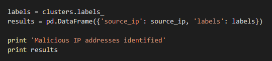
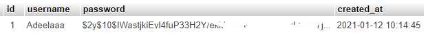
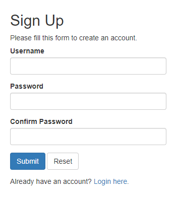
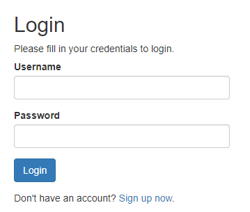
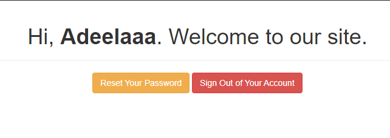
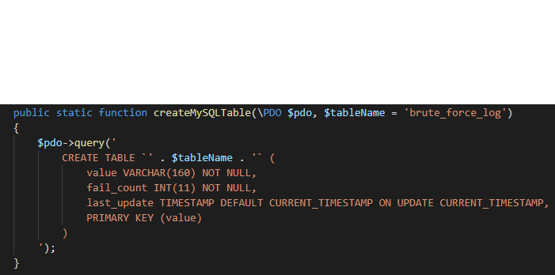
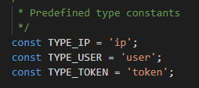

# FINAL PROJECT IDS
## BRUTE-FORCE DETECTION

Nama : Adeela Nurul F.

NRP  : 05311840000001

## Pendahuluan

Pertama saya berniat menggunakan Phyton untuk membaca access log, kemudian memberikan notifikasi ketika ada log yang dicurigai sebagai brute force. Namun, sayangnya saya tidak bisa menemukan cara agar program phyton ini bisa membaca access log secara real-time. Selain itu, saya juga kesulitan mencari hosting web gratis yang menyediakan access log.

Kemudian saya mencari cara lain, dan menemukan cara lain yaitu menggunakan PHP.

## Langkah-Langkah

1. Mencoba menggunakan Python

Awalnya saya menemukan script _Brute-Force Detector_ pada github dengan link sebagai berikut: [brute-force detector](https://github.com/rahul2992/hack_detection)

Scritp ini menggunakan Pyton. Cara kerjanya secara sederhana adalah dengan membaca access log untuk mencari IP yang berulang kali mengakses web dalam waktu yg sangat singkat. Untuk outputnya sendiri kurang lebih akan menghasilkan tulisan peringatan beserta IP yang mencurigakan

Namun script ini tidak bisa mengakses access log secara _real-time_ sehingga tidak bisa memberikan peringatan yang _real-time_ juga. Oleh karena itu saya mencari cara agar script ini bisa digunakan secara _real-time_. Kemudian muncul masalah baru, yaitu mengenai access log. Saya kesulitan menemukan hosting web gratis yang menyediakan access log. Akhirnya saya meninggalkan cara ini dan mencari cara yang lain.

2. Membuat Web Login

Hosting web dilakukan di [mipropia](https://mipropia.com/). Dengan alamat web login yang telah saya buat adalah [adeelaaa](http://adeelaaa.mipropia.com/register.php?)

Pertama-tama kita perlu menyiapkan database untuk menyimpan username dan password

Selanjutnya adalah menyiapkan page untuk melakukan register atau sign-up. Dengan source code : [code](scriptphp_web/register.php)

Kemudian menyiapkan page lainnya, seperti page [login](scriptphp_web/login.php) dan [welcome](scriptphp_web/welcome.php)

3. Brute-Force Detector

Pertama, akan dibuat tabel yang bertjuan untuk menyimpan __fail_count__ atau berapa kali user gagal login/mengakses sesuatu dan __last_update__ atau waktu terakhir data diupdate

Membuat 3 konstanta

